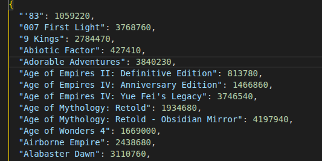
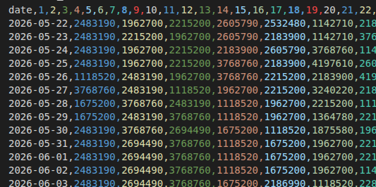
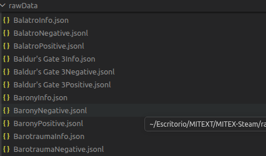
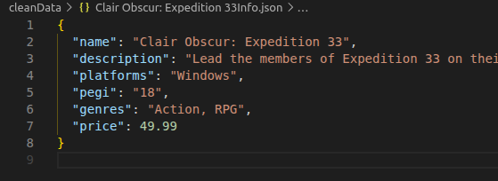
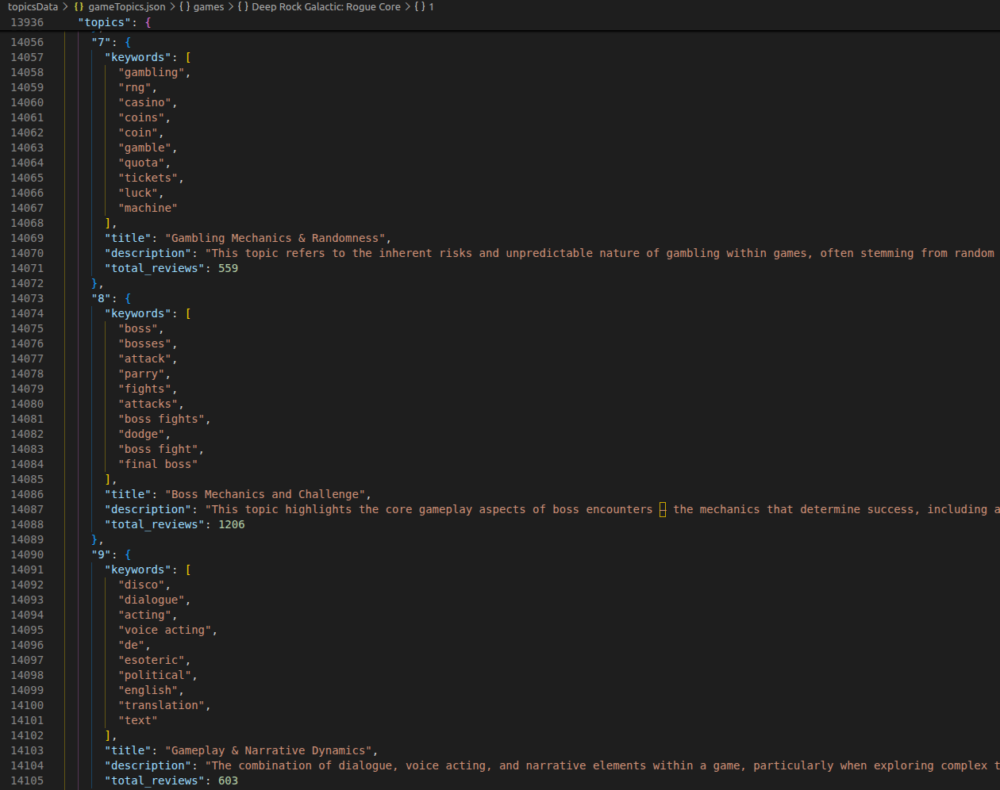
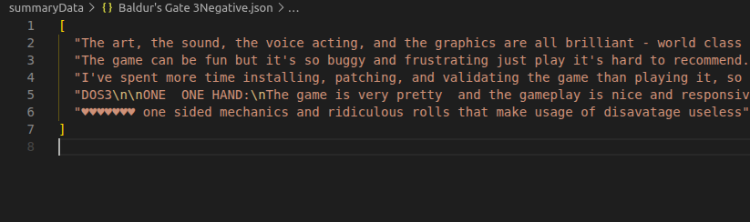
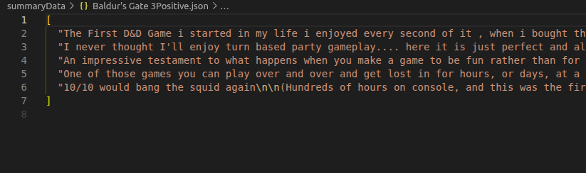
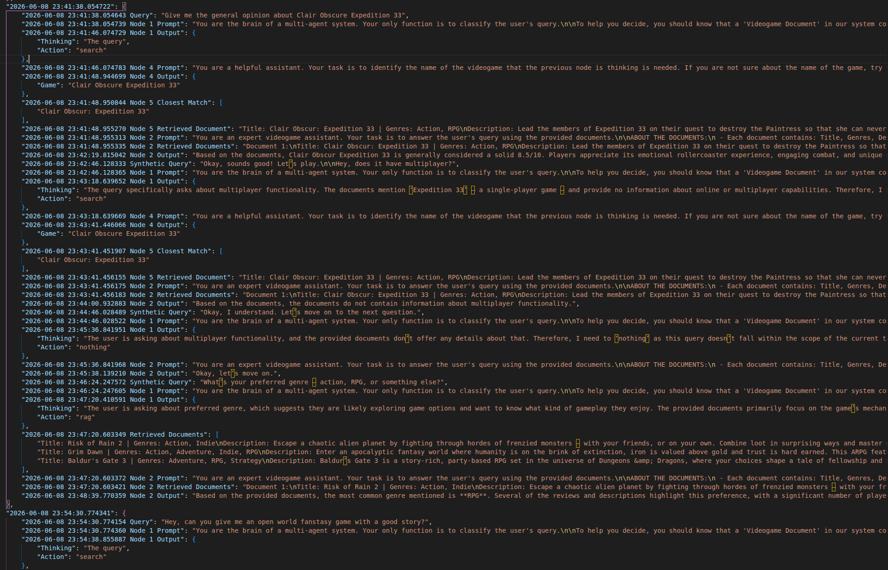

## DISEÑO Y ARQUITECTURA DEL SISTEMA

El diseño de este sistema nace de la necesidad de resolver el problema asociado con la construcción de un chatbot basado en RAG (Retrieval-Augmented Generation) que sea capaz de responder preguntas complejas sobre un catálogo de videojuegos extenso y dinámico como el de Steam, sin saturar la ventana de contexto de los modelos de lenguaje ni incurrir en costes de computación prohibitivos. La arquitectura propuesta aborda este desafío mediante una división estructural clara y unificada en dos fases: un pipeline de procesamiento o fase offline, dedicado a la construcción y enriquecimiento de la base de conocimiento, y una fase online, encargada de la resolución de consultas en tiempo real. Esta bifurcación técnica garantiza que el sistema disponga de información estructurada y de alta densidad semántica antes de que el usuario interactúe con la interfaz.

En la fase offline, el flujo de información avanza de manera secuencial. El proceso se inicia con la captura automatizada de datos comerciales y técnicos de la plataforma Steam, los cuales se someten a un proceso de limpieza profunda para erradicar el ruido. La información depurada se somete a dos procesos de análisis paralelos: por un lado, se ejecuta un modelado de tópicos global que identifica las corrientes de opinión y las temáticas latentes de la comunidad; por otro, se aplica un algoritmo de resumen extractivo basado en grafos y utilidad para sintetizar las reseñas. Ambos flujos convergen en la estructuración de los Documentos RAG, que consolidan la ficha técnica de cada videojuego, almacenándose finalmente en una base de datos vectorial.

Esta base de conocimiento es la que permite el correcto funcionamiento de la fase online, la cual está gobernada por una infraestructura multi-agente coordinada por una clase centralizadora denominada Organizador u Orchestrator. Cuando el usuario realiza una consulta, este componente orquesta el flujo a través de cinco nodos secuenciales. El Nodo Uno actúa como el cerebro clasificador, analizando el historial de la conversación para determinar si la consulta del usuario requiere recuperar un documento de la base vectorial, una búsqueda léxica directa por el nombre del título del videojuego, o una interacción genérica para la que no precisa información extra. Si la consulta es directa sobre un título, se activa el Nodo Cuatro para extraer el nombre exacto del videojuego bajo restricciones estrictas de salida. Posteriormente, el Nodo Cinco gestiona la recuperación del documento del videojuego aplicando algoritmos de emparejamiento difuso y, en caso de no hallar el título en el registro local, ejecuta de manera autónoma un proceso de extracción web en caliente, forzando la actualización inmediata de la base de datos a través del pipeline offline. Si la duda requiere un análisis profundo, el flujo se redirige al Nodo Tres para ejecutar la recuperación híbrida de documentos en la base vectorial. Toda la información recuperada por cualquiera de las vías converge finalmente en el Nodo de Generación (Nodo Dos), el cual procesa el contexto depurado y genera la respuesta definitiva, cerrando un ciclo modular y adaptativo.

## IMPLEMENTACIÓN Y ROBUSTEZ TÉCNICA DEL PIPELINE

### Obtención de los datos

La robustez técnica de la implementación se sostiene sobre un pipeline de procesamiento de datos dividido en módulos independientes donde cada uno resuelve una problemática específica del ciclo de vida de la información. En la fase inicial de obtención de datos, el problema principal radica en la volatilidad del mercado de videojuegos, donde los títulos más vendidos cambian diariamente. La solución implementada consiste en un script automatizado mediante una acción de GitHub que se ejecuta diariamente a medianoche para iterar sobre las listas de los más vendidos de Steam, almacenando los datos en un registro estructurado que crece de manera incremental. El resultado son dos archivos, uno donde almacenamos el nombre del videojuego con su identificador (`videogames.json`):

Y otro archivo CSV con los identificadores de los juegos más vendidos por cada día (`topSellers.csv`):

De esta manera, obtenemos un flujo de datos actualizado diariamente que alimenta el sistema con los títulos más relevantes del mercado, asegurando que el chatbot siempre tenga acceso a información actualizada.

Con los identificadores de los juegos más vendidos, se ejecuta un proceso de extracción masiva de datos utilizando la API de Steam para obtener la ficha técnica de cada juego y sus reseñas. El resultado es un conjunto de archivos JSON (tres por cada videojuego), donde uno de ellos contiene toda la información que proporciona la página principal del título en Steam, otro almacena las reseñas negativas del juego en inglés y el último, las positivas. Estos archivos JSON se encuentran en la carpeta `rawData`:

Además, para cada reseña almacenamos la puntuación de utilidad que los usuarios de Steam han otorgado a cada opinión, lo cual se convierte en un dato crucial para el posterior proceso de resumen extractivo basado en grafos, permitiendo priorizar las opiniones más valoradas por la comunidad.

### Limpieza y preprocesamiento de datos

Respecto a la limpieza de datos, el problema técnico identificado fue la alta redundancia de los datos originales de la API de Steam y la contaminación de las reseñas por comentarios en idiomas distintos al inglés. La solución adoptada fue el desarrollo de un pipeline de limpieza que utiliza procesamiento en paralelo para aprovechar al máximo los múltiples núcleos de la CPU. Este componente limpia el texto de las opiniones, elimina aquellas reseñas que carecen de contenido o que pertenecen a otros idiomas, y reduce la ficha técnica del juego a seis campos clave esenciales para el sistema de recuperación: nombre, descripción, plataformas compatibles, clasificación por edades (PEGI), géneros y precio. El resultado es un conjunto de archivos optimizados en la carpeta `cleanData` que aceleran drásticamente las fases de lectura y vectorización posteriores. A continuación, se muestran imágenes de ejemplo con los archivos resultantes para un título concreto:

### Modelado de tópicos

En el módulo de modelado de temas, el problema principal consistía en descubrir las corrientes de opinión dominantes y los aspectos críticos de los videojuegos entre miles de comentarios heterogéneos sin depender de clasificaciones manuales. Además, se buscaba asociar videojuegos no solo por sus géneros, sino por despertar opiniones o reacciones similares en la comunidad (ya fueran positivas o negativas).

La solución consistió en integrar la librería `BERTopic` para procesar todas las reseñas limpias de forma conjunta (no por juego separado), permitiendo identificar patrones temáticos generales. Primero, se aplica un filtro exhaustivo de _stopwords_ que combina los términos genéricos del inglés con una lista personalizada de vocabulario propio del sector de los videojuegos (`game`, `play`, `like`, etc.). A continuación, se realiza una reducción de dimensionalidad mediante la técnica UMAP basada en la similitud del coseno, seguida de un agrupamiento por densidad con el algoritmo HDBSCAN, exigiendo un volumen mínimo por grupo para garantizar la relevancia estadística.

Para evitar redundancias en las palabras clave de cada tema, se aplica un criterio de Máxima Relevancia Marginal (MMR), y finalmente se implementa una estrategia de reasignación de elementos atípicos o ruidosos utilizando la frecuencia de término inversa (c-TF-IDF). Con este proceso se obtiene una extracción limpia de 24 tópicos semánticos (excluyendo el clúster de ruido) que caracterizan desde mecánicas de combate hasta problemas de rendimiento técnico.

Un reto adicional fue el elevado volumen inicial de reseñas en el clúster de ruido. Para solventarlo, se reasignaron a los temas principales mediante c-TF-IDF, recalculando posteriormente las palabras clave para salvaguardar la precisión.

Una vez definidos estos clústeres, se utiliza un LLM local para procesar las palabras clave representativas y generar, de forma automática, un título descriptivo corto y una explicación orientada a la experiencia del usuario para cada tópico.

Posteriormente, se reorganiza esta estructura orientada a clústeres en una vista centrada en el videojuego, mapeando qué porcentaje y volumen de cada tema aparece en las opiniones de un título concreto.

Con el objetivo de seleccionar los mejores hiperparámetros para el modelo de tópicos, se realizaron diversas pruebas comparando los clústeres obtenidos y evaluando su coherencia semántica. Para medir objetivamente esta última, se utilizó el `CoherenceModel` de la librería `Gensim`. Tras las iteraciones, se seleccionó la siguiente configuración:

- **Vectorización:** Umbral de frecuencia mínima de 5 reseñas (para omitir términos anecdóticos) y límite superior del 80 % (para neutralizar vocabulario excesivamente general). Se incluyen n-gramas de hasta 2 palabras para capturar expresiones compuestas comunes.
- **Reducción de dimensionalidad (UMAP):** 30 vecinos para equilibrar la preservación de la estructura local y global del espacio vectorial, proyectando los datos a 5 dimensiones.
- **Agrupamiento (HDBSCAN):** Tamaño mínimo de clúster de 80 para garantizar suficiente representación estadística, y un umbral de selección de 0,1.
- **Diversidad (MMR):** Factor de diversidad de 0,3 para asegurar que las palabras clave no sean redundantes.
- **Reducción de outliers (Clúster -1):** Umbral de 0,05 para evitar reasignaciones forzadas, incrementando la coherencia semántica global y controlando el ruido.
- **Número de tópicos:** Limitado a 25 tópicos finales para mantener el equilibrio entre diversidad temática y facilidad de interpretación.

En el archivo `gamesTopics.json` (dentro de la carpeta `topicsData`) se registran los tópicos extraídos para cada videojuego junto con el porcentaje de reseñas asociadas. Al final del archivo se incluyen los títulos y descripciones sintetizados por el LLM:

### Resumen extractivo

Por último, el módulo de resumen extractivo aborda el problema de condensar el valor semántico de miles de opiniones positivas y negativas sin saturar el contexto del modelo lingüístico con ideas reiterativas. La solución fue diseñar un algoritmo de resumen basado en grafos (utilizando la librería `NetworkX`). El sistema divide las reseñas en frases individuales a través del tokenizador de `NLTK` y las convierte en vectores densos mediante embeddings. Utilizando estos vectores, se construye un grafo no dirigido donde los nodos representan las frases y los pesos de las aristas miden la similitud del coseno entre ellas, descartando los enlaces por debajo de un umbral de 0,3 para filtrar el ruido.

Para priorizar las opiniones más valiosas, el algoritmo ejecuta una variante personalizada de `PageRank` que emplea las puntuaciones de utilidad nativas de Steam como ponderación de inicio. Para evitar que las reseñas excesivamente largas dominen la centralidad del grafo de forma injusta, se aplica una amortiguación logarítmica que divide la puntuación de utilidad de cada frase por el logaritmo del total de frases de su reseña original. El resultado es la selección matemática de las 5 frases más representativas y con mayor densidad de información para el espectro positivo y negativo de cada título.

Los resultados se almacenan en la carpeta `summaryData`. A continuación, se muestra el resultado del resumen extractivo para el juego _Baldur's Gate 3_:

### Estructuración de los documentos RAG

El reto final de la fase offline consistía en unificar los datos técnicos limpios, la distribución porcentual de los tópicos globales y los resúmenes de opiniones en un formato de documento estructurado que fuera óptimo tanto para la indexación vectorial como para la asimilación conceptual por parte del modelo en la fase online. La solución fue diseñar una plantilla estandarizada de generación de documentos. La función `addDocsToCollection` consolida los datos de cada videojuego, combinando la información técnica de `cleanData`, los resúmenes de opiniones de `summaryData` y los porcentajes de temas de `gameTopics.json`. Con este bloque estructurado, se genera un documento final que se vectoriza a través de un modelo de embeddings y se almacena en una base de datos vectorial ChromaDB. Para evitar duplicados e identificar de forma única cada videojuego, el identificador único se calcula aplicando un hash SHA-256 sobre su nombre.

Por cada videojuego, el bloque de texto se estructura de la siguiente manera:

- **Título:** El nombre del videojuego.
- **Géneros:** Los géneros a los que pertenece el juego según Steam.
- **Descripción:** La descripción general del juego.
- **Resumen de reseñas positivas:** Las 5 frases más representativas extraídas del procesamiento basado en grafos (o un texto por defecto si no existen).
- **Resumen de reseñas negativas:** Las 5 frases más representativas extraídas del procesamiento basado en grafos (o un texto por defecto si no existen).
- **Temas asociados:** Una lista de los tópicos detectados por `BERTopic` en sus reseñas, detallando el título del tema, su explicación orientada a la experiencia de usuario y el porcentaje de relevancia que tiene dentro del juego.

Además, se añaden metadatos adicionales a cada documento (como el precio, las plataformas compatibles y la clasificación PEGI) para enriquecer el filtrado estructurado del RAG ante consultas específicas.

### Orquestador y nodos de consulta

El motor interactivo en tiempo real del sistema está gobernado por la clase `Orchestrator`, la cual gestiona el ciclo de vida completo de la consulta del usuario. El problema principal de este componente era cómo garantizar un enrutamiento determinista y robusto de las interacciones sin que las respuestas ambiguas del modelo rompieran la lógica de control. La solución consistió en implementar el Nodo Uno, un agente clasificador dotado de un decodificador restringido (`TokenSequenceConstraint`) que obliga al modelo a devolver exclusivamente una estructura JSON válida que determina la acción siguiente: recuperación global (`rag`), búsqueda directa (`search`) o interacción vacía (`nothing`). Esto erradica por completo los fallos sintácticos en la toma de decisiones y permite al organizador derivar la consulta al nodo correspondiente de forma predecible.

Cuando la acción seleccionada es `rag`, el flujo pasa al Nodo Tres, que ejecuta una búsqueda híbrida combinando BM25 y búsqueda vectorial para recuperar los tres documentos más relevantes de ChromaDB. Por el contrario, si el usuario hace una consulta sobre un título específico, se activan de forma secuencial el Nodo Cuatro y el Nodo Cinco. El reto aquí consistía en aislar con precisión el nombre del videojuego (Nodo Cuatro) y mitigar la ausencia de títulos recientes en la base de datos. La solución del Nodo Cinco aplica un emparejamiento difuso (con un umbral del 60 % de similitud). Si el título no se encuentra indexado localmente, el nodo ejecuta de forma reactiva una petición de extracción web sobre la tienda de Steam con `BeautifulSoup`, importando los datos del juego y forzando la actualización en caliente del pipeline offline.

Finalmente, toda la información contextual recuperada converge en el Nodo de Generación (Nodo Dos). El problema técnico principal en esta fase de síntesis era evitar la alucinación, mitigar la repetición literal de textos y optimizar la latencia causada por reevaluar todo el historial de la conversación. La solución consistió en diseñar directrices estrictas de reformulación y síntesis en su prompt. El resultado es un agente que proporciona respuestas contextualizadas con una latencia optimizada.

## DISCUSIÓN, VALIDACIÓN Y EVALUACIÓN CRÍTICA

La validación del sistema se ha estructurado en torno al análisis cualitativo y cuantitativo directo de los componentes offline (modelado de tópicos y resúmenes) y online (enrutamiento de consultas, coincidencia léxica y recuperación), basándose estrictamente en las métricas e implementaciones del código y los registros de ejecución.

### 1. Validación del Modelado de Tópicos (BERTopic)

La evaluación de los tópicos semánticos se realiza comparando las métricas de coherencia semántica $C_v$ de Gensim y la proporción de reseñas clasificadas como ruido (outliers) antes y después del algoritmo de reasignación. Al ejecutar el pipeline definido en `topicModeling.py`, se obtienen las siguientes métricas experimentales:

- **Estado Inicial (antes de la reasignación de outliers):** Se obtiene un total de 24 tópicos con una proporción de outliers del 43,98 % y un valor de coherencia semántica $C_v$ de 0,4706.
- **Estado Optimizado (tras la reasignación c-TF-IDF con un umbral de 0,05):** El porcentaje de outliers se reduce al 16,56 %, mientras que la coherencia semántica $C_v$ de Gensim se eleva hasta 0,5433, demostrando una cohesión semántica interna más sólida tras reasignar las opiniones ruidosas a sus tópicos más afines.

El análisis de los temas extraídos revela agrupamientos de alto valor conceptual que superan las categorías rígidas de género de Steam. Por ejemplo, el _Tópico 8_ (enfocado en combate: _"parry"_, _"attack"_, _"dodge"_, _"boss"_) permite asociar semánticamente títulos tan dispares en género como _Elden Ring_ (action-RPG/Souls) y _Clair Obscur: Expedition 33_ (combate por turnos), puesto que ambos exigen precisión en mecánicas de esquiva y contraataque. Asimismo, el _Tópico 11_ aísla con precisión problemas de optimización de red, quejas sobre tramposos (_cheaters_) e incompatibilidades de sistemas _anticheat_.

**Limitaciones detectadas:** Se observó un desbalance en el tamaño de los clústeres. El _Clúster 0_ funciona como un saco genérico que engloba un volumen desproporcionado de comentarios genéricos, mientras que los clústeres periféricos son sumamente específicos. Los experimentos de ajuste de hiperparámetros indicaron que intentar reducir el clúster genérico fragmenta en exceso los temas específicos, lo que sugiere una limitación intrínseca de los datos (reseñas de Steam) en la que muchas opiniones expresan valoraciones afectivas cortas sin referencias técnicas o mecánicas concretas.

### 2. Validación de los Resúmenes Extractivos de Reseñas

La robustez de la fase de resumen extractivo se valida a través del diseño algorítmico y matemático implementado en `extractiveSummary.py`:

- **Filtrado de Similitud Semántica:** Para evitar redundancias, el grafo no dirigido construido con `NetworkX` solo añade aristas entre oraciones si su similitud del coseno de embedding supera el umbral de 0,3 (`similarityThreshold = 0.3` en la línea 59). Esto descarta relaciones débiles y oraciones redundantes en el grafo.
- **Ponderación por Utilidad y Mitigación de Longitud:** Para evitar la selección de comentarios anecdóticos, se personaliza el vector inicial de `PageRank` con la utilidad de Steam de cada reseña. Sin embargo, para evitar que las reseñas muy extensas dominen injustamente la centralidad de sus oraciones en el grafo, la puntuación de utilidad se amortigua logarítmicamente dividiéndola por el logaritmo del total de oraciones del comentario original (`distributed_scores = reviewScore / (1 + math.log(num_sentences))` en la línea 48), favoreciendo oraciones con una alta densidad informativa.

### 3. Validación de la Fase Online y el Sistema Multi-Agente

Para el análisis dinámico en tiempo real y la traza del flujo del orquestador, el sistema registra la secuencia de prompts, contextos recuperados de la base vectorial ChromaDB y salidas en el log de ejecución `completeExecutions.json`, ubicado en la raíz del proyecto.

- **Confiabilidad del Enrutamiento (Nodo 1):** Mediante la integración de decodificadores guiados con la restricción sintáctica `TokenSequenceConstraint` (en las líneas 139-150 de `main.py`), se garantiza un 100 % de validez sintáctica de la salida. El LLM online está limitado a generar únicamente una estructura JSON correcta con una de las opciones predefinidas de acción (`nothing`, `rag` o `search`), impidiendo cualquier fallo sintáctico o salida de texto plano que rompa el flujo de control del orquestador.
- **Extracción de Entidades y Coincidencia Difusa (Nodos 4 y 5):**
  - La extracción del nombre del videojuego está estructurada bajo la misma restricción gramatical restringiendo la salida a `{"Game": "[Nombre]"}` en el Nodo 4.
  - La coincidencia difusa del Nodo 5 emplea `difflib.get_close_matches` con un umbral de coincidencia del 60 % (`cutoff=0.6` en la línea 317) para mitigar variaciones ortográficas de los usuarios.
  - En caso de fallar la coincidencia en la base local, la petición HTTP en caliente a la tienda de Steam con `BeautifulSoup` y la posterior indexación offline incremental descargan e indexan la información del juego de manera reactiva, haciéndolo disponible de inmediato en la base ChromaDB.

A continuación, se adjunta un fragmento de los logs generados en `completeExecutions.json` que muestra una traza de ejecución del orquestador:

### 4. Limitaciones y Áreas de Mejora

A pesar de los resultados satisfactorios, la evaluación detallada de los logs ha desvelado dos limitaciones persistentes:

1. **Copias literales del contexto:** En ocasiones, el Nodo 2 tiende a volcar fragmentos del resumen extractivo directamente en lugar de reformularlos de manera fluida. Aunque las reglas del prompt del sistema redujeron este comportamiento, para eliminarlo por completo se requeriría el uso de modelos con mayor capacidad de síntesis o la aplicación de filtros de post-procesamiento lingüístico.
2. **Redundancia en consultas sucesivas:** El sistema carece de memoria sobre las búsquedas vectoriales previas en la misma sesión. Si un usuario hace preguntas consecutivas muy similares, el Organizador activa de nuevo la búsqueda híbrida y recupera exactamente los mismos documentos. La implementación de un mecanismo de caché semántica en el orquestador optimizaría enormemente el flujo en conversaciones largas.

## Cambios aplicados desde la entrega inicial

- Refinamiento de prompts en los Nodos 1, 2, 4 y Sintético para asegurar respuestas más coherentes y estructuradas, mitigando la repetición y las alucinaciones.
- Unificación de los datos de validación del modelado de tópicos (coherencia semántica, outliers y umbrales de reasignación) con los resultados de la ejecución real de `topicModeling.py`.
- Eliminación de métricas de pruebas sintéticas estimadas que no se registran formalmente en archivos persistentes, basando la validación de la fase online estrictamente en las trazas estructurales de `completeExecutions.json` y las restricciones gramaticales de la inferencia.
- Corrección de errores ortográficos, typos gramaticales y redacción general de todo el informe.
- Guardado de la caché KV de los system prompts de cada nodo en ficheros para no tener que volver a generarla.
